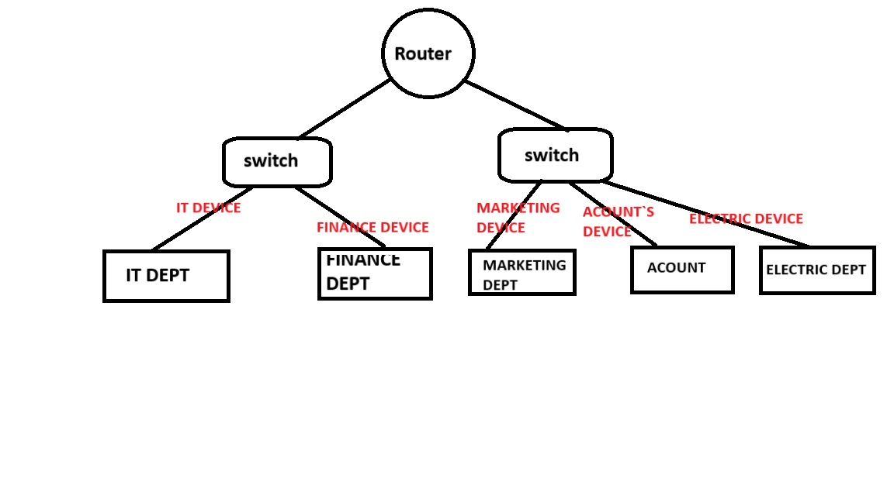

# Pahari Home Solutions Internship 2024: Network

## Network Topology for Pahari Home Solutions Pvt Ltd

### 1. Overview

This repository contains the hybrid network topology designed for Pahari Home Solutions Pvt Ltd's office setup. The network is tailored to meet the requirements of various departments, ensuring efficient data transmission and secure communication.

### 2. Office Setup

The office consists of the following departments:
- **HR Department**: 6 computers
- **Sales Department**: 10 computers
- **Finance Department**: 4 computers
- **IT Department**: 8 computers and 2 servers

### 3. Hybrid Network Topology

The network combines both **star** and **mesh topologies**:
- **Star Topology**: Applied within each department, where all devices are connected to a central switch.
- **Mesh Topology**: Applied between the core router and IT servers to ensure redundancy and high availability.

### 4. IP Subnetting

Each department is assigned its own subnet for better traffic management and security:
- **HR Department**: `194.165.17.01/24`
- **Sales Department**: `192.448.20.05/24`
- **Finance Department**: `152.168.30.06/24`
- **IT Department**: `192.188.404.08/24`

The subnet mask used for each department is **255.255.255.0**, providing 254 usable IP addresses per department.

### 5. Routing Protocols

The network uses **static routing** between subnets to ensure direct and efficient communication. Each department's subnet is connected through a core router, and static routes are manually configured to direct traffic between them.

#### Example of a Static Route:

## I use ms-word, ms-paint 

